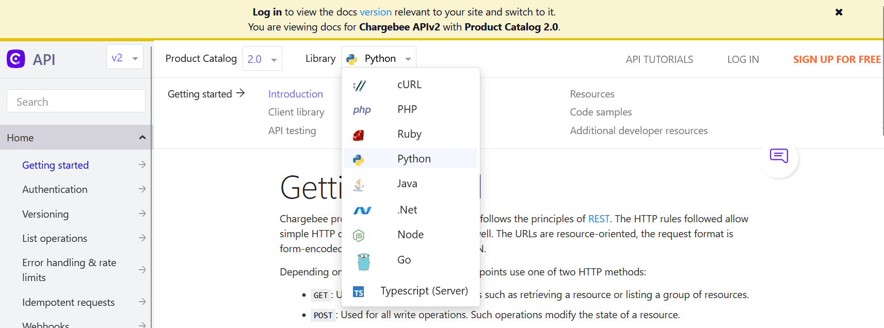

# Chargebee Integration with AWS Lambda
[Chargebee](https://www.chargebee.com/) is a recurring billing and subscription management tool that helps subscription businesses streamline their Revenue Operations. It offers a variety of functionality, including:
- Managing recurring billing and subscriptions seamlessly
- Supporting hybrid business models
- Enabling expansion of global footprint
- Automating self-serve workflows for all use-cases.

Chargebee also offers native reporting functionality, but there may be times where one might have more complex reporting needs than what is available on the platform by default. Fortunately, Chargebee also has a marketplace of third party tools that you can leverage to meet a variety of needs, and they also offer an API that you can use to build your own!

This guide will walk you through one option for how you can build your own integration using Amazon Web Services (AWS). More specifically, you will be able to ingest data from your Chargebee account into AWS and use that data for your own custom reporting workflows.

## Pre-Requisites
- A free [AWS account](https://aws.amazon.com/free/)
- A free [Chargebee](https://www.chargebee.com/) account
- Chargebee API Key
- Programming Fundamentals

>:bulb: It is highly recommended that the steps followed in this guide are done in your Test environment in Chargebee and a development account in AWS.

## Architecture Overview

The architecture for this guide is very straightforward. [AWS Lambda](https://aws.amazon.com/lambda/) will initiate an export API call to the Chargebee API. A secondary Lambda will download those files once they are ready.  All of your exported Chargebee files will be stored in [Amazon S3](https://aws.amazon.com/s3/). [AWS Step Functions](https://aws.amazon.com/step-functions/) will orchestrate the entire workflow, and an optional [Amazon EventBridge Scheduler](https://docs.aws.amazon.com/eventbridge/latest/userguide/scheduler.html) will trigger the workflow on a scheduled basis.

## Implementation Instructions

### Step 0: [Optional] Import Sample Data to Chargebee
You may already have sample data to work with in your Chargebee environment, and you are welcome to use that for this tutorial. If you do not have sample data, feel free to use the sample data provided in the `chargebee-sample-customer-data.csv` file that is included in this repository. Follow the steps found in Chargebee's [Bulk Operations documentation](https://www.chargebee.com/docs/2.0/bulk-operations.html) to pre-load this data before continuing on.

### Step 1: Chargebee Configuration
In this guide, we will be making use of the [Chargebee API](https://apidocs.chargebee.com/docs/api?prod_cat_ver=2). The Chargebee API supports a number of programming languages. You'll want to make sure you select both the Product Catalog version that is relevant to the version of Chargebee you are using as well as your supported programming language of choice to make sure you are seeing the correct documentation for your environment. 

For the purpose of this tutorial, we will be using `Product Catalog 2.0` as the version and `Python` as the language.

