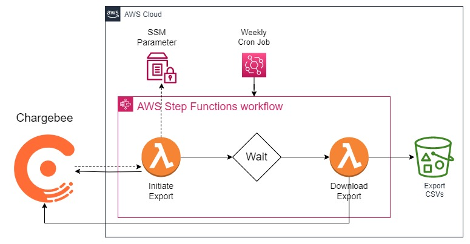

# Chargebee Integration with AWS Lambda
[Chargebee](https://www.chargebee.com/) is a recurring billing and subscription management tool that helps subscription businesses streamline their Revenue Operations. It offers a variety of functionality, including:
- Managing recurring billing and subscriptions seamlessly
- Supporting hybrid business models
- Enabling expansion of global footprint
- Automating self-serve workflows for all use-cases.

Chargebee also offers native reporting functionality, but there may be times where one might have more complex reporting needs than what is available on the platform by default. Fortunately, Chargebee also has a marketplace of third party tools that you can leverage to meet a variety of needs, and they also offer an API that you can use to build your own!

[This tutorial](https://toriancrane.github.io/chargebee-lambda-integration/) will walk you step by step on how you can build your own integration using Amazon Web Services (AWS). More specifically, you will be able to ingest data from your Chargebee account into AWS and use that data for your own custom reporting workflows.

The contents of this repo can be used for a one click deployment of the AWS infrastructure as code.

## Pre-Requisites
- A free [AWS account](https://aws.amazon.com/free/)
- A free [Chargebee](https://www.chargebee.com/) account
- A [Chargebee API Key](https://www.chargebee.com/docs/2.0/api_keys.html)
  - It is recommended to follow the best practices of least privileges when assigning access to your API key.
- Sample customer data in Chargebee (dummy customer data has been provided in this repo)

>:bulb: It is highly recommended that the steps followed in this guide are done in your Test environment in Chargebee and a development account in AWS.

## Architecture Overview

The architecture for this guide is very straightforward. [AWS Lambda](https://aws.amazon.com/lambda/) will initiate an export API call to the Chargebee API. A secondary Lambda will download those files once they are ready. All of your exported Chargebee files will be stored in [Amazon S3](https://aws.amazon.com/s3/). [AWS Step Functions](https://aws.amazon.com/step-functions/) will orchestrate the entire workflow, and your Chargebee API key will be stored in (and referenced from) [AWS Systems Manager Parameter Store](https://docs.aws.amazon.com/systems-manager/latest/userguide/systems-manager-parameter-store.html). The parameter will be encrypted using [AWS Key Management Service](https://aws.amazon.com/kms/). An optional [Amazon EventBridge Scheduler](https://docs.aws.amazon.com/eventbridge/latest/userguide/scheduler.html) can trigger the workflow on a scheduled basis.

## Deployment Instructions

TBD
