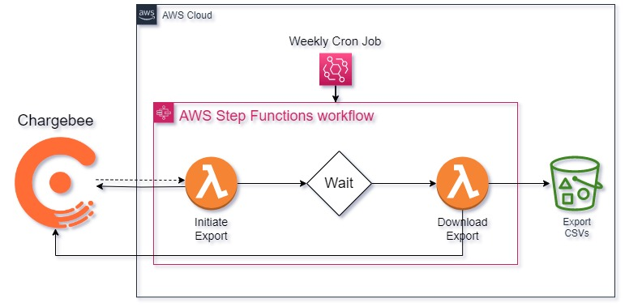

# Chargebee Integration with AWS Lambda
[Chargebee](https://www.chargebee.com/) is a recurring billing and subscription management tool that helps subscription businesses streamline their Revenue Operations. It offers a variety of functionality, including:
- Managing recurring billing and subscriptions seamlessly
- Supporting hybrid business models
- Enabling expansion of global footprint
- Automating self-serve workflows for all use-cases.

Chargebee also offers native reporting functionality, but there may be times where one might have more complex reporting needs than what is available on the platform by default. Fortunately, Chargebee also has a marketplace of third party tools that you can leverage to meet a variety of needs, and they also offer an API that you can use to build your own! This application is a custom exporting integration between Chargebee and Amazon Web Services (AWS).

# Table of Contents

1. [Pre-Requisites](#pre-requisites)
2. [Architecture Overview](#architecture-overview)
3. [Step-by-Step Tutorial](#step-by-step-tutorial)
4. [Deployment Instructions](#deployment-instructions)

## Pre-Requisites
- A free [AWS account](https://aws.amazon.com/free/)
- A free [Chargebee](https://www.chargebee.com/) account
- A [Chargebee API Key](https://www.chargebee.com/docs/2.0/api_keys.html)
  - It is recommended to follow the best practices of least privileges when assigning access to your API key.
- Sample customer data in Chargebee (dummy customer data has been provided in this repo)
- Programming fundamentals (if you require your own custom export lambda function logic)

## Architecture Overview



The architecture for this solution is very straightforward. [AWS Lambda](https://aws.amazon.com/lambda/) will initiate an export API call to the Chargebee API. A secondary Lambda will download those files once they are ready. All of your exported Chargebee files will be stored in [Amazon S3](https://aws.amazon.com/s3/). [AWS Step Functions](https://aws.amazon.com/step-functions/) will orchestrate the entire workflow, and your Chargebee API key will be stored in (and referenced from) [AWS Systems Manager Parameter Store](https://docs.aws.amazon.com/systems-manager/latest/userguide/systems-manager-parameter-store.html). The parameter will be encrypted using [AWS Key Management Service](https://aws.amazon.com/kms/). An optional [Amazon EventBridge Scheduler](https://docs.aws.amazon.com/eventbridge/latest/userguide/scheduler.html) can trigger the workflow on a scheduled basis.

## Step-by-Step Tutorial

[This tutorial](https://toriancrane.github.io/chargebee-lambda-integration/) will walk you step by step on how you can build your own integration using AWS. More specifically, you will be able to ingest data from your Chargebee account into AWS and use that data for your own custom reporting workflows.

## Deployment Instructions

If you are already comfortable working with the services included in this architecture, you can deploy the template in this repository to build the necessary AWS resources automatically. The sample code in the `chargebee-export.py` makes use of Chargebee's [Export Customers](https://apidocs.chargebee.com/docs/api/exports?prod_cat_ver=2#export_customers) to retrieve a list of all Chargebee customers. You are welcome to customize this function (included in-line as part of the `rExportLambda` resource in the `main.yaml` file) to meet whatever exporting needs you have (see the [Chargebee API Documentation](https://apidocs.chargebee.com/docs/api?prod_cat_ver=2) for more details on available APIs.).

1. Login to your AWS account and navigate to the [S3 console](https://s3.console.aws.amazon.com/s3/home). Upload the [chargebee-requests-lambda-layer.zip](https://github.com/toriancrane/chargebee-lambda-integration/blob/main/aws/chargebee-requests-lambda-layer.zip) file to an S3 bucket of your choice. Make a note of the S3 Bucket name and object key as you will provide them as parameter values in a later step.
2. Navigate to the [CloudFormation](https://us-east-1.console.aws.amazon.com/cloudformation/home?region=us-east-1#/) console. Make sure your region is set to one closer to you. You can see which region you are in by looking in the top right corner of your AWS Console.
3. Click "Create Stack". Under the **"Specify a template"** section, select the radio button next to **"Upload a template file"**. Click **"Choose file"** and upload the [main.yaml](https://github.com/toriancrane/chargebee-lambda-integration/blob/main/aws/main.yaml) file located in the `aws` folder of this repo. Then click **"Next"**.
4. Provide a name for the stack (Ex: `chargebee-exporter-app` ) and provide values for the request parameters.
  - Chargebee Site Name: `<the name of your Chargebee site>`
	- Chargebee API Key: `<the value of your Chargebee API Key>`
	- Chargebeen Bucket Name: `<The name to give your Chargebee storage bucket.>`
	    - S3 Bucket names has specific rules so make sure whatever name you provide meets those requirements. See the S3 [Bucket Naming Rules](https://docs.aws.amazon.com/AmazonS3/latest/userguide/bucketnamingrules.html) documentation for more information.
	- Lambda Layer Bucket Name: `<the name of the S3 Bucket you uploaded the Lambda Layer to>`
	- Lambda Layer Object Key: `<the object key of the lambda layer e.g. folder/chargebee-requests-lambda-layer.zip>`

5. Click **"Next"** until you reach the **"Review your-stack name"** screen. Scroll down to the bottom and make sure to click the acknowledge checkbox in the **"Capabilities"** section. Then click submit. You can view the progress of the CloudFormation deployments in the CloudFormation console under the **Events** tab.

6. To test your deploment, navigate to the deployed State Machine and trigger a new execution using the following input object

```
{
  "Status": "",
  "ExportId": "",
  "Url": ""
}
```

### Things to Note:

The Event Bridge Scheduler resource has been deployed in a disabled state, mostly to serve as an example of how to integrate a State Machine with a CRON job. You can configure this resource to meet whatever your recurring export needs are, or you remove the resource altogether if it is unneeded.
