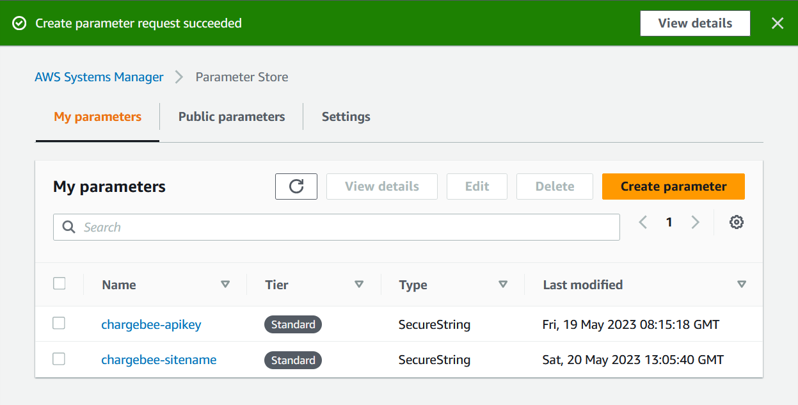

# Chargebee Integration with AWS Lambda
[Chargebee](https://www.chargebee.com/) is a recurring billing and subscription management tool that helps subscription businesses streamline their Revenue Operations. It offers a variety of functionality, including:
- Managing recurring billing and subscriptions seamlessly
- Supporting hybrid business models
- Enabling expansion of global footprint
- Automating self-serve workflows for all use-cases.

Chargebee also offers native reporting functionality, but there may be times where one might have more complex reporting needs than what is available on the platform by default. Fortunately, Chargebee also has a marketplace of third party tools that you can leverage to meet a variety of needs, and they also offer an API that you can use to build your own!

This guide will walk you through one option for how you can build your own integration using Amazon Web Services (AWS). More specifically, you will be able to ingest data from your Chargebee account into AWS and use that data for your own custom reporting workflows.

## Pre-Requisites
- A free [AWS account](https://aws.amazon.com/free/)
- A free [Chargebee](https://www.chargebee.com/) account
- [Chargebee API Key](https://www.chargebee.com/docs/2.0/api_keys.html)
  - It is recommended to follow the best practices of least privileges when assigning access to your API key.
- Programming fundamentals

>:bulb: It is highly recommended that the steps followed in this guide are done in your Test environment in Chargebee and a development account in AWS.

## Architecture Overview

The architecture for this guide is very straightforward. [AWS Lambda](https://aws.amazon.com/lambda/) will initiate an export API call to the Chargebee API. A secondary Lambda will download those files once they are ready. All of your exported Chargebee files will be stored in [Amazon S3](https://aws.amazon.com/s3/). [AWS Step Functions](https://aws.amazon.com/step-functions/) will orchestrate the entire workflow, and your Chargebee API key will be stored in (and referenced from) [AWS Systems Manager Parameter Store](https://docs.aws.amazon.com/systems-manager/latest/userguide/systems-manager-parameter-store.html). The parameter will be encrypted using [AWS Key Management Service](https://aws.amazon.com/kms/). An optional [Amazon EventBridge Scheduler](https://docs.aws.amazon.com/eventbridge/latest/userguide/scheduler.html) can trigger the workflow on a scheduled basis.

## Implementation Instructions

  
<h3>Step 0: [Optional] Import Sample Data to Chargebee</h3>

---

You may already have sample data to work with in your Chargebee environment, and you are welcome to use that for this tutorial. If you do not have sample data, feel free to use the sample data provided in the `chargebee-sample-customer-data.csv` file that is included in this repository. Follow the steps found in Chargebee's [Bulk Operations documentation](https://www.chargebee.com/docs/2.0/bulk-operations.html) to pre-load this data before continuing on.

  
<h3>Step 1: Select a Region</h3>

---

This application can be deployed in any AWS region that supports all of the services used in this application (see the Architecture Overview section). You can refer to the [region table](https://aws.amazon.com/about-aws/global-infrastructure/regional-product-services/) to see which regions support these services. For the purpose of this guide, we will be creating resources in the US East (N. Virginia) region. You can select this region from the dropdown in the upper right corner of the [AWS Management Console](https://console.aws.amazon.com/console/home).

  
<h3>Step 2: Create an AWS Systems Manager Parameter</h3>

---

AWS Systems Manager (SSM) Parameter Store provides the ability to securely store data such as passwords, database strings, and license codes as parameter values. 

In this step, you will use the AWS console to create an SSM Parameter that will store the value of the Chargebee API key. We will later reference this value in our Lambda script that will invoke the Chargebee API.

---

a. In the AWS Console, navigate to the AWS Systems Manager service. The click the `Parameter Store` link in the left hand menu.

b. Then click `Create parameter`.

c. On the **Create parameter** provide a unique name for your parameter. For the purpose of this guide, we will use `chargebee-apikey` as the name. Keep the default Tier of `Standard` selected.

d. Under **Type**, select the `SecureString` radio button. This will apply encryption to the value that is stored in the parameter. Under the **KMS Key ID** section, a default KMS key will auto-populate. This will be the key that is used to encrypt the parameter data. 

> :bulb: You have the ability to create your own KMS key, but that requires additional configuration that is outside of the scope of this guide. See the [AWS Key Management Service Developer Guide](https://docs.aws.amazon.com/kms/latest/developerguide/overview.html) for more details.

e. In the **Value** text box, enter the value of your Chargebee API key. Then click the `Create parameter` button to create your parameter.

You should see the following in the SSM Parameter Store console upon successful creation:

  
<h3>Step 3: Create a Lambda Function to initiate an Export from Chargebee</h3>

---

In this guide, we will be making use of the [Chargebee API](https://apidocs.chargebee.com/docs/api?prod_cat_ver=2). The Chargebee API supports a number of programming languages. You'll want to make sure you select both the Product Catalog version that is relevant to the version of Chargebee you are using as well as your supported programming language of choice to make sure you are seeing the correct documentation for your environment. 

For the purpose of this tutorial, we will be using `Product Catalog 2.0` as the version and `Python` as the language.

